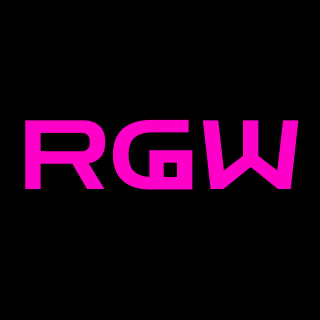
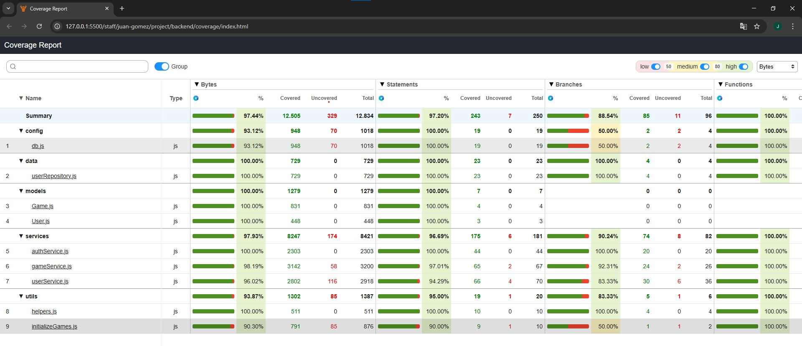

# Project Name
Retro Gaming World

## Introduction

Retro Gaming World is a website designed by and for nostalgic fans. Great hits from the past come together to remind us that what we consider spectacular today had simple origins. No complex gameplay mechanics, just fun.
This is the essence of video games: to make us enjoy ourselves, and with this idea, we seek to reach an audience that already lived through this wonderful era, attracting young people and introducing them to the great classics.
Enjoy it alone, with friends, or however you prefer! Retro Gaming World opens its doors to you!

## Functional Description

The website will allow you to register, play the variety of games available, rate them, comment on them, and record your scores. You can even mark the games you like the most as favorites! Remember, you can also customize your profile, for example, by adding an avatar of your choice. And if you get tired of your username, email, or password, don't worry! You can also change them.

### Use Cases

- Create an account
- Log in
- Edit your account
- Delete your account
- View playable games
- Play games
- View game options (favorites, likes, dislikes, high scores, comments)
- View your profile page
- Edit your profile
- View your favorite games page
- Delete messages
- Delete your account

## UI/UX Design

[Aqui mi link](https://www.figma.com/design/fToTgRo8hcjUxl2uNbJs0u/Retro-Gaming-World?node-id=0-1&t=hKUJGRAyuKRCMGuu-1) 

## Technical Description

### Technologies & Libraries

- React
- Vite
- Tailwind
- react-router
- Express
- Node
- Axios
- Mongo+Mongoose
- Mocha Chai
- Bcrypt 
- Token Library (jwt)

### Data Models

user{
  username: 'string'
  email: 'string'
  password: 'string'
  id: objectId
  avatar: 'string'
  favorite: [gameId]
}

game{
  id: objectid,
  name: string
  description: string
  cover: string
  highScore: {
    score: number,
    user: userId(_id)
  }
  like: userId(_id),
  dislike: userId(_id),
  comments: {
    author: userId(_id)
    comment: string,
    date: DateNow() with formatted function
  }
}

User model:
const userSchema = new mongoose.Schema({
    username: { type: String, required: true, unique: true, trim: true },
    email: { type: String, required: true, unique: true, lowercase: true, trim: true },
    password: { type: String, required: true },
    avatar: { type: String, default: null },
    favorites: [{ type: Number }]
}, { timestamps: true })

Game model:
const gameSchema = new mongoose.Schema({
    id: { type: Number, required: true, unique: true },
    name: { type: String, required: true },
    description: String,
    image: String,
    likes: [{ type: mongoose.Schema.Types.ObjectId, ref: 'User' }],
    dislikes: [{ type: mongoose.Schema.Types.ObjectId, ref: 'User' }],
    highscores: [{
        user: { type: mongoose.Schema.Types.ObjectId, ref: 'User', required: true },
        score: { type: Number, required: true }
    }],
    messages: [{
        user: { type: mongoose.Schema.Types.ObjectId, ref: 'User', required: true },
        text: { type: String, required: true },
        timestamp: { type: Date, default: Date.now }
    }]
})

### Test Coverage

 

## Project

If you have deployed your app, add the link here!

